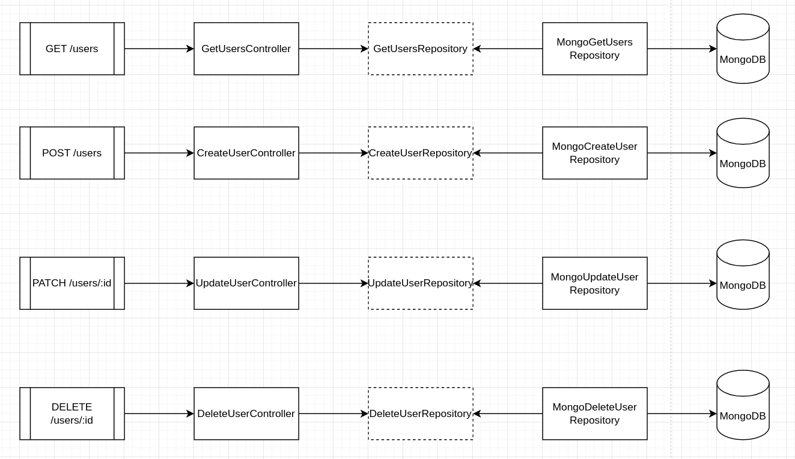

# User API

- Completa, com um CRUD de usuários, usando Node, Express, TypeScript e MongoDB.
  Também faremos o seu deploy para o Railway.

<br>
<hr>
<br>

## Conceitos utilizados:

<br>
- Princípios do SOLID<br>
- Injeção de dependência (Dependency Injection)<br>
- Repository Pattern

<br>

## Entidades

<br>

```
User {
  id: string;
  firstName: string;
  lastName: string;
  email: string;
  password: string;
}

```

<br>

## Rotas

<br>

GET /users - retorna os usuários salvos no banco<br>
POST /users - cria um usuário<br>
PATCH /users/:id - atualiza um usuário<br>
DELETE /users/:id - deleta um usuário

<br>

## Arquitetura


